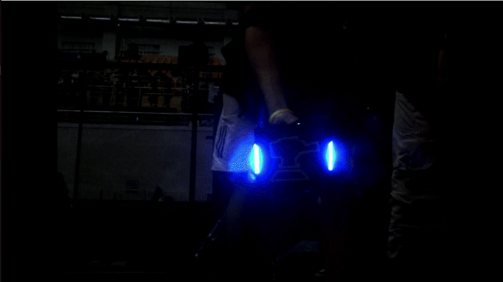

基于Ultralytics YOLOv8框架，制作装甲板数据集并训练模型，对原始视频进行装甲板检测，生成带绿框的检测结果GIF，完全符合考核上传要求。
- `assets/`：仅存放合规的检测结果GIF（无冗余视频）
  - `result.gif`：装甲板检测结果动图（大小≤50M）
- `code/`：存放所有源代码及配置文件
  - `train_yolo.py`：YOLO模型训练脚本
  - `infer_video.py`：视频推理并绘制绿框脚本
  - `labelme2yolo.py`：Labelme标注转YOLO格式脚本
  - `extract_frames.py`：视频帧提取脚本
  - `dataset.yaml`：YOLO训练数据集配置文件
  - `CMakeLists.txt`：CMake构建配置文件
  - `dataset/`：装甲板标注数据集目录
  - `runs/`：模型训练权重及日志目录
- `README.md`：任务说明及结果展示文档
example:
（考核示例参考）

result:

